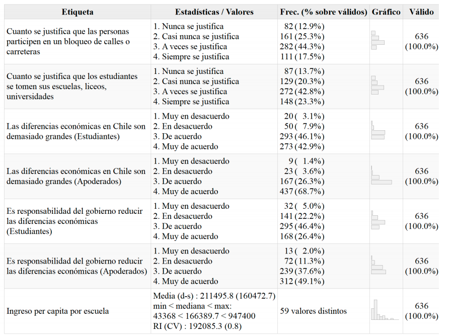

class: slideInRight, middle, inverse

```{r xaringanExtra, include=FALSE}
xaringanExtra::use_xaringan_extra(c("tile_view", "animate_css"))
# xaringanExtra::use_share_again()
# xaringanExtra::use_scribble()
xaringanExtra::use_progress_bar(color = "red", location = "top", height = "100em")

```


# __Desigualdad, familia y protesta__

# El rol de la transmisión de las preferencias redistributivas en la justificación de la protesta radical de secundarios

<br>
<hr>

.pull.right[Agradecimientos al FONDECYT n°1181239]

.small[
* Francisco Meneses, Asistente de investigación
* Juan Carlos Castillo, Coinvestigador 
* Julio Iturra, Coordinador
* Martín Venegas, Ayudante de investigación] 

---

layout: true
class: animated, fadeIn

---
class: slideInRight, middle, inverse

***
# __Contextualización académica__ :
***
---

# Contexto académico de producción


          
  * __FONDECYT n°1160921__: "Economía moral de la meritocracia y preferencias redistributivas" [(Juan Carlos Castillo)]()
  
  > Critica y justificación de la desigualdad

      
      
  
 
.


 
  * __FONDECYT n°1181239__: “Socialización política y educación para la ciudadanía: el rol de la familia y de la escuela” [(Cristian Cox)]()
      
      >  Reproducción intergeneracional 
      
      + PACES, Panel de Ciudadanía Escolar
      


      
      
???

Este trabajo recoge aportes teóricos de dos líneas de investigación y los utiliza para estudiar el fenómeno del estallido social.

Leer primer proyecto, y señalar: Se recoge la importancia de la crítica y legitimación de la desigualdad, considerándola una posible causa de las protestas.

Leer el segundo: Por otra parte, se recoge la importancia de los agentes de socialización, la familia y la escuela.

Además, se utilizara para los análisis los datos producidos por este Fondecyt. 

---
class: slideInRight, middle, inverse

***
# __Introducción__: Protesta y desigualdad en Chile
***

---
# Problematización: 

* Chile desigualdad y economía moral (Currie, 2017;
Garretón, 2014 ; Sandel, 2021)

*  La historia de Vilma en "Saltar el torniquete"

  + Familia y desigualdad

.center[]

???


La advertencia de sociólogos como Manuel Garretón se ha transformado en una realidad evidenciable: La
desigualdad amenaza con socavar la democracia (Currie, 2017; Garretón, 2014; Sandel, 2021). Las consecuencias de la desigualdad en la política han mutado en Chile durante los últimos años. La apatía política de jóvenes y sectores vulnerables se transforma en una creciente politización (Palet Araneda & Coloma, 2015) Esta politización tiene rasgos activistas, fuera de lo institucional (Muñoz-Tamayo & Durán-Migliardi, 2019) y, en algunas ocasiones, posee rasgos de acción directa o disruptiva (Alé et al., 2021).

Leer Saltar el torniquete

Enfatizar la alusión a la familia y a la desigualdad en el relato donde se justifica la acción directa. 

---
# Teorías e Hipótesis

_Socialización política_ (Miranda & Castillo, 2021)

* $H_1$: Las preferencias redistributivas son transmitidas de padres a hijos

_interés racional_ (Koos & Sachweh, 2019; Andreoli & Olivera, 2020)

* $H_2$: Padres con menor nivel socioeconómico tendrán mayores preferencias redistributivas.

_Critica a la desigualdad y ciudadanía_ Easterbrook (2021); Hooghe (2016)

* $H_3$:Estudiantes con mayores preferencias redistributivas justifican en mayor medida acciones de protesta disruptiva.

???

__Socialización política__ Como señalan (Miranda & Castillo, 2021), no podemos comprender a los jóvenes como sujetos aislados, sino
que deben entenderse como actores encarnados en un contexto determinado, en el cual, sus familias y las ideas
de sus familias poseen una relevante influencia. 


__Preferencias redistributivas__ Aunque se ha destacado la importancia del contexto y las creencias morales, el interés personal sigue siendo importante a la hora de predecir las preferencias redistributivas, de modo tal que estas son mayores entre quienes tienen menores ingresos. 

__Critica a la desigualdad y ciudadanía__

las sensaciones de injusticia respecto a la desigualdad social pueden afectar aspectos
políticos de los jóvenes, motivando acciones subversivas e insurreccionales (Easterbrook, 2021). Esta evidencia
es consistente con el estudio de Hooghe et al. (2016) quien destaca que en países más desiguales los jóvenes asocian la idea de buen ciudadano a alguien crítico y dispuesto a protestar por sus derechos, mientras que en países acomodados la idea de ciudadanía se asocia al respeto por el orden y las leyes. De ambas evidencias se puede deducir que personas de menor nivel socioeconómico, con menor y con mayores sensaciones de injusticia son más proclives a una visión activa de ciudadanía e incluso a sentimientos de insubordinación.

---
# Modelo teórico


???

Las ideas anteriores se pueden resumir en el siguiente modelo.

En él se denota que un menor nivel socioeconómico fomenta preferencias redistributivas en los padres y, a su vez, en los hijos. Además, se propone que estas preferencias redistributivas estarán asociadas con la justificación de acciones de protesta disruptiva como cortar calles o tirar piedras. Además, se espera un efecto directo del nivel socioeconómico en la justificación de los actos de protesta.   


---

class: slideInRight, middle, inverse

***
# __Metodo__: Datos variables y metodología
***
---

# Datos

- Panel de Ciudadanía Escolar (PACES): Estudio longitudinal con muestra representativa de estudiantes de segundo medio, apoderados y profesores en la Región Metropolitana y las comunas de Antofagasta, Calama, Talca, Curicó y Linares.

- Muestra original: 1635 estudiantes, 744 apoderados en 64 escuelas.

- Muestra para este estudio (transversal): 491 estudiantes y apoderados en 59 escuelas


---


# Descripción de variables


- **Justificación de movilización disruptiva:** Justificación de acciones de protesta que involucran usualmente situaciones de desorden, riesgo e incluso ilegalidad. 

---
# Descripción de variables

## Variables independientes

- **Preferencias redistributivas:** Deseo de los individuos de que las sociedades disminuyan sus niveles de desigualdad

  + Juicios sobre la desigualdad: _Las diferencias económicas en Chile son demasiado grandes_. Muy de acuerdo (4) a Muy en desacuerdo (1)
  
  + Redistribución: _Es responsabilidad del gobierno reducir las diferencias económicas_. Idem
  
- **Ingresos de los padres**
---
# Metodología

* Mediación: Permite comprender el mecanismo causal entre variables, evaluando como el efecto de "x" a "y" se da mediante "m". 

* Ecuaciones de Senderos Estructurales (SEM): Permite evaluar la relación entre constructos latentes

---
class: slideInRight, middle, inverse

***
# Resultados
***
---
.center[


]
---
# Bivariado
.center[

]

---
# Correlaciones

.center[

]
---


$n$=491 $\chi^2$ $(gl)$=22.056 (12), $p-value$ = 0.037, $CFI$ = 0.992, $RMSEA$ =0.041  

---

# Conclusión

1. Desigualdad, ingresos y redistribución

2. Socialización, economía moral y redistribución 

3. Redistribución y protesta


---
class: invert, middle

.center[
# ¡Muchas gracias!
]